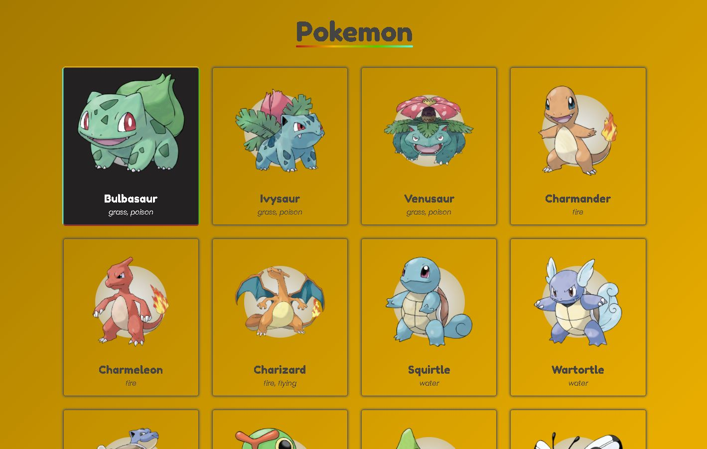

# POKEMON - POKEDEX

## Consumir API do PokeAPI - Apresentação

## Resultado do projeto

O proposito de fazer esse aplicação foi para treinar aplicações com Javascript Vanilha, como consumir API, realizar e resolver várias promises, renderizar vários elementos em tela.
